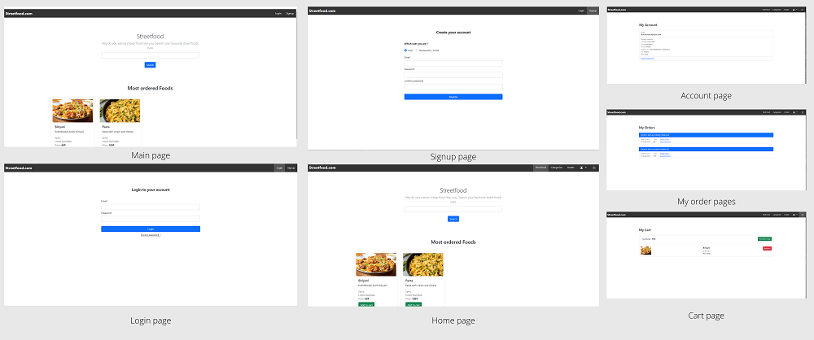

# Streetfood

**Version 1.0.0**

 

 

Decrypta is a fully functional <b>one-to-one</b> messaging app that helps <b>Soldiers</b> to communicate each other and also to chat with their families and friends . Its a dedicated commication system for people who works in <b>Nation's secuirity</b> fields. This simple app enable users to send <b>Text</b> and <b>Multimedia</b> messages like images.

# Table of content 

1. [Installation](#Installation)

2. [Running the sample app](#Running-the-sample-app)

3. [Technology used](#Technology-used)

4. [More about this app](#More-about-this-app)

5. [Contributors](#Contributors)

6. [License & Copyright](#License-&-Copyright)

## Installation

You can download or clone repository to your PC. Then <b>Import</b> or <b>Add</b> source code into your project.
* How to Clone or download : <https://docs.gitlab.com/ee/gitlab-basics/start-using-git.html#dhttps://github.com/MasayukiSuda/GPUVideo-androidownload-vs-clone>
* How to Import project : <https://www.tvisha.com/blog/how-to-import-a-project-in-android-studio>

## Running the sample app

 * To run this app, first you need to connect the project into <b><i>Firebase console</i></b>. Then paste <b><i>google-service.json</i></b> file into the project folder (project-name/app) after that build and run the project. 
 * How to connect with firebase : <http://alphatech.technology/Howto-Entry-srk/Google-Services-Json-bek/>
 
**IMPORTANT** 

   * Only registered users(soldiers) are allowed to use this app. So that first you need to add a special user number and details into database.
   * On the other end, if you want to register as a civilian you need to add civilian phone number to soldier connections list.

## Technology used

- Frontend : <b>Java , xml </b>
- Backend : <b>Firebase</b>

## More about this app

This  system also have an <b>Admin</b> app written in <b>vue js</b> to monitorize <b>Illegal activities</b> occur in communication channels. ie If someone tries to share <b>sensitive infromation</b> or to spy with a civllian, at that instant, app will send a <b>Illigal activity alert</b> to Admin app with sender,receiver details and geo cordinates.Decrypta also not allow users to take chat screenshots  and also can't download images into devices. It will be available on cloud.

## Contributors

- Muhsin Shah (<muhsinshah21@gmail.com>)

## License & Copyright 
> Copyright (C) 2020 Muhsin Shah.  
> Licensed under the [MIT] license.  
